# SUDOKU CLASSIC VERSION

- Thử nghiệm game :

# Giới thiệu game 

Sudoku là 1 tựa game đơn giản, phổ biến với đại đa số mọi người trên toàn thế giới. Người chơi có nhiệm vụ điền vào
các ô trống các chữ số từ 1-9  sao cho mỗi hàng, mỗi cột và mỗi cặp ô 3x3 không có bất kì số nào trùng nhau. Vì là 
game giải đố nên game giúp người chơi tăng tính tư duy logic cho người chơi, giúp tăng khả năng fix bug khi gặp vấn 
đề.

# Cấu trúc game

Cấu trúc của game gồm có 2 phần chính:

- Bảng game Sudoku
- Các phần tử trong bảng
- ## Bảng game Sudoku
- Thiết kế bằng SDL, màu lấy từ file ảnh:  , 
- Nút restart : 

# Các Phần tử trong bảng
|  Phần tử | Ảnh|
|-----------------|---------------|
|Số 1 hợp lệ | 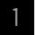|
|Số 2 hợp lệ | |
|Số 3 hợp lệ | |
|Số 4 hợp lệ | 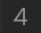|
|Số 5 hợp lệ | 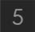|
|Số 6 hợp lệ | 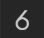|
|Số 7 hợp lệ | 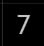|
|Số 8 hợp lệ | |
|Số 9 hợp lệ | 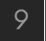|
|Số 1 ko hợp lệ | 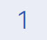|
|Số 2 ko hợp lệ | 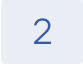|
|Số 3 ko hợp lệ | 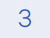|
|Số 4 ko hợp lệ | |
|Số 5 ko hợp lệ | |
|Số 6 ko hợp lệ | 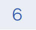|
|Số 7 ko hợp lệ | |
|Số 8 ko hợp lệ | 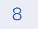|
|Số 9 ko hợp lệ | |

# Chức năng game 
- Máy sẽ random ra màn hình 1 bảng game Sudoku ngẫu nhiên chưa hoàn chỉnh.
- Người chơi sẽ điền các giá trị từ 1-9 vào các ô trống; nếu giá trị sai thì hiện màu đỏ, đúng thì hiện màu đen
- Người chơi hoàn thành khi toàn bộ các ô đều hoàn thành.
- Nhấn nút restart để tạo bảng game Sudoku mới.
  # Mã nguồn
  |           File nguồn    |Chức năng|
  |--------------------------|---------|
  |main.cpp| Tạo giao diện đồ họa và khởi tạo game, quản lý các sự kiện trên game |
  |board.cpp| Tạo bảng sudoku ngẫu nhiên, quản lý các sự kiện xảy ra trên bảng sudoku   |
  |entity.cpp| Đại diện cho các thực thể trong trò chơi, với các thuộc tính như vị trí, kích thước và texture. |
  |render_window.cpp|Quản lý cửa sổ và hiển thị đối tượng đồ họa trên cửa sổ SDL |
  |mouse.cpp| Theo dõi vị trí của con trỏ chuột và kiểm tra liệu con trỏ đó có nằm trong một đối tượng Entity hay không |
  |math.cpp| Định nghĩa các phép toán cơ bản và các chức năng để làm việc với các vector 2 chiều |
  |square.cpp| Lưu trữ thông tin và trạng thái của mỗi ô trong bảng Sudoku, bao gồm giá trị, vị trí, trạng thái được chọn, màu sắc và texture; cung cấp các phương thức để kiểm tra và cập nhật trạng thái của ô.

